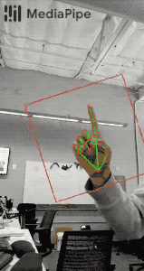
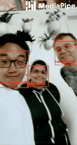

#CVTech - Computer Vision Package
#### Author: Prasoon Patel

---
This is a Computer vision package that uses Image processing using **OpenCV** and Artificial Intelligence using **Mediapipe, TensorFlow, Keras** functions.

#Getting Started

---
cvtech package can be installed in your python environment using pip.
```python
pip install cvtech
```
and it also can be upgraded to latest version using :
```python
pip install cvtech --upgrade
```

Currently, cvtech package is having the solution for below modules:

* Hand Detection
* Face Detection
* Face Mesh Detection
* Human Body Tracking
* Video background change.

# User Guide

---
### Hand Detection
[]
```python
def main():
    cap = cv2.VideoCapture(0)
    detector = HandDetector()
    while True:
        success, img = cap.read()
        hands, img = detector.find_hands(img)

        if hands:
            hand1 = hands[0]
            lm_list1 = hand1["lm_list"]
            fingers1 = detector.fingers_up(hand1)

            if len(hands) == 2:
                hand2 = hands[1]
                lm_list2 = hand2["lm_list"]
                fingers2 = detector.fingers_up(hand2)
                length, info, img = detector.find_distance(lm_list1[8], lm_list2[8], img)

        cv2.imshow("Image", img)
        cv2.waitKey(1)


if __name__ == "__main__":
    main()
```
### Hand Landmarks:


### Face Detection
[]
```python
def main():
    cap = cv2.VideoCapture(0)
    detector = FaceDetector()
    while True:
        success, img = cap.read()
        img, bboxs = detector.find_faces(img)

        cv2.imshow("Image", img)
        cv2.waitKey(1)


if __name__ == "__main__":
    main()
```

### Face Mesh Detection
[]
```python
def main():
    cap = cv2.VideoCapture(0)
    detector = FaceMeshDetector()
    while True:
        success, img = cap.read()
        img, faces = detector.find_faceMesh(img, draw=False)

        if faces:
            print(faces[0])

        cv2.imshow("Image", img)
        cv2.waitKey(1)


if __name__ == "__main__":
    main()
```


### Human body Detection
[]
```python
def main():
    cap = cv2.VideoCapture(0)
    detector = HumanDetector()
    while True:
        success, img = cap.read()
        img = detector.find_humans(img)

        cv2.imshow("Image", img)
        cv2.waitKey(1)


if __name__ == "__main__":
    main()
```


### Video Background Change
```python
def main():
    cap = cv2.VideoCapture(0)
    detector = SelfieSegmentation()
    bg_image = cv2.imread('C:/Users/praso/Downloads/1.jpg')
    while True:
        success, img = cap.read()
        img = detector.remove_bg(img, img_bg=bg_image, threshold=0.8)

        cv2.imshow("Image", img)
        cv2.waitKey(1)


if __name__ == "__main__":
    main()
```